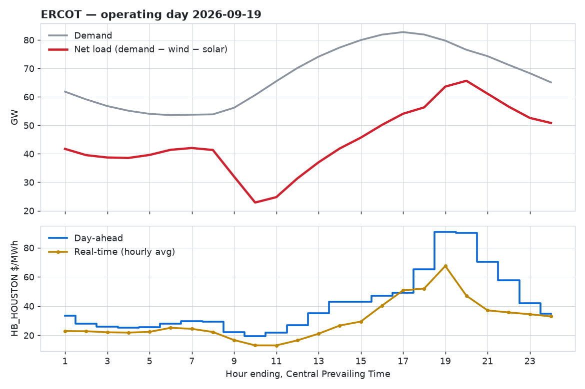

# ercot-daily

[](https://github.com/arturbagmanov/ercot-daily/actions/workflows/daily.yml)

Yesterday in ERCOT, updated every morning: demand, net load (demand minus
wind and solar), and the day-ahead versus real-time price at the Houston hub.

<!-- RECAP:START -->
**Operating day 2026-09-19** (hours ending, Central Prevailing Time)

<picture>
  <source media="(prefers-color-scheme: dark)" srcset="reports/latest-dark.png">
  
</picture>

- Demand peaked at **HE17** at 82.8 GW; net load peaked at **HE20** at 65.7 GW.
- Evening ramp: net load rose **7.0 GW** from HE17 to HE21.
- HB_HOUSTON: day-ahead averaged \$41.05/MWh, real-time \$29.96/MWh. Widest real-time minus day-ahead spread: **−\$42.95** at HE20.
<!-- RECAP:END -->

## Why net load

Demand peaks in the late afternoon, but wind and solar supply part of it.
What the dispatchable fleet must cover is net load, and in summer it peaks
hours after demand, as solar drops away. That gap is where evening prices
are set. The full five-year analysis is in
[net-load-forecasting-ercot](https://github.com/arturbagmanov/net-load-forecasting-ercot).

## How it works

A GitHub Action runs twice each morning. It pulls the previous operating day
from ERCOT's Public API, appends it to [`data/daily.csv`](data/daily.csv),
redraws the chart, and rewrites the recap above. Commits come from
`github-actions[bot]`.

| Series | ERCOT product | Note |
|---|---|---|
| Demand | NP6-345-CD | ERCOT total, hourly |
| Wind, solar | NP4-732-CD, NP4-737-CD | Actual output (GEN), not potential (HSL) |
| Day-ahead price | NP4-190-CD | HB_HOUSTON, hourly |
| Real-time price | NP6-905-CD | HB_HOUSTON, 15-minute settlements averaged to the hour |

The wind and solar reports only keep 48 hours of actuals, so this repository
keeps its own history: `data/daily.csv` grows by one day every run.

Demand here is ERCOT's own reported load. The forecasting project uses
EIA-930 demand, which is defined slightly differently, so the two will not
match to the megawatt.

## Run locally (Windows PowerShell)

```powershell
python -m venv .venv
.venv\Scripts\Activate.ps1
pip install -e ".[dev]"
pytest
$env:ERCOT_API_USERNAME = "..."
$env:ERCOT_API_PASSWORD = "..."
$env:ERCOT_API_SUBSCRIPTION_KEY = "..."
python -m ercot_daily.cli run
```

## Licence

MIT
